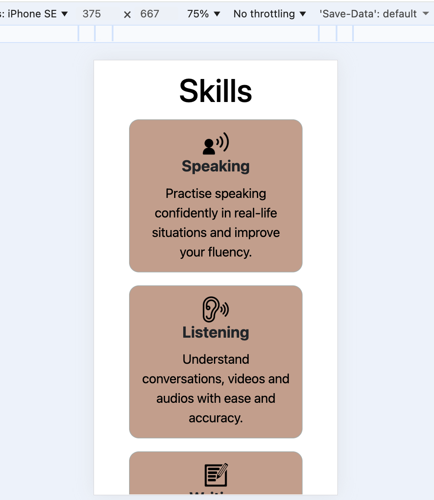
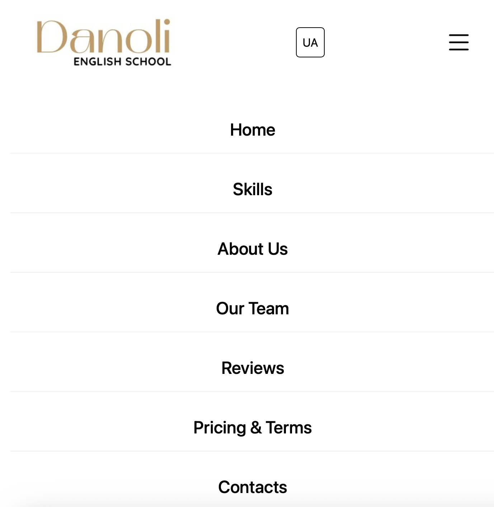
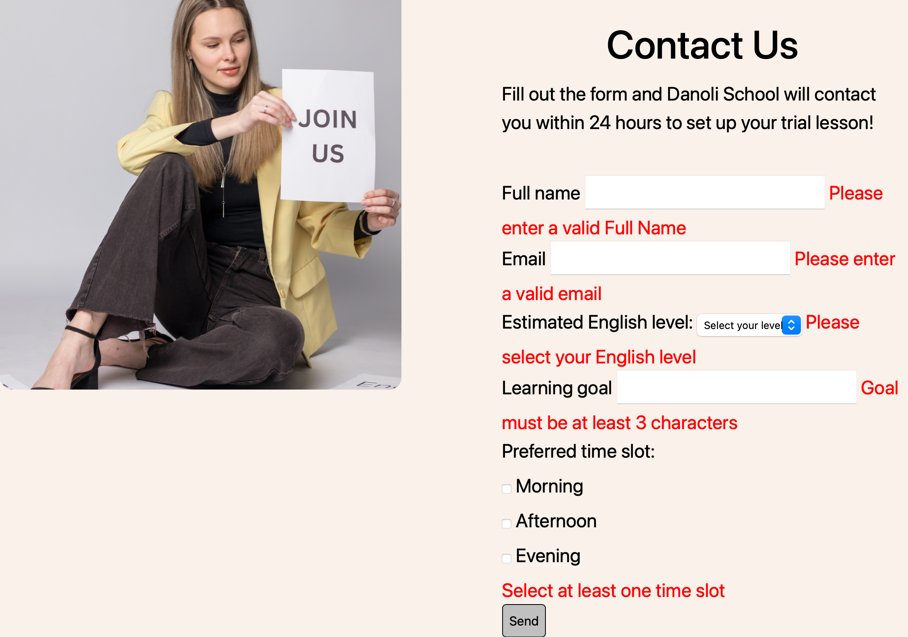
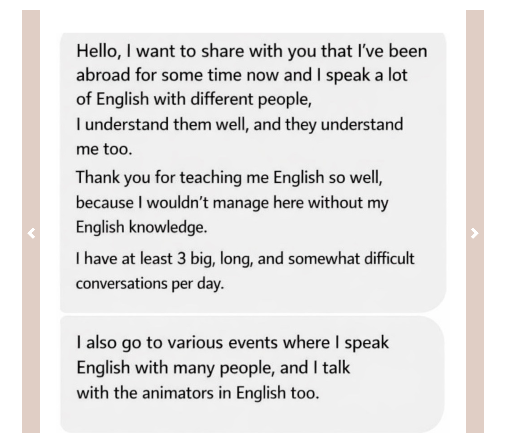

## What is the idea?
Online English School  

* **Starting point:** an existing online English school operating through social media platforms. 
   
* **The problem:** absence of a professional organization.  
  
* **Goal:** create a centralized space for information.
  
---

## The structure
:::: {.columns}

::: {.column width="50%"}
* **Header** 
  - Welcome banner 
  - Navigation menu
* **Hero section**
   - Hero image
   - Hero text
   - button 
:::

::: {.column width="50%"}
* **Other sections**
   - skills
   - About us
   - Reviews
   - Pricing
   - Terms and conditions
   - Contacts
* **footer**
  - social networks
:::

::::

---

## what I used
**HTML**  
**Key features**: semantic hierarchy and organization.


```html
<!DOCTYPE html>
<html> 
  <head></head>
  <body>
    <header></header>
    <section></section>
    <section></section>
    <section></section>
    <footer></footer>
  </body>
</html>
```

---

**Language button**  
{width="30%"}  
HTML
```html
<a href="ua.html" class="language-button"> UA </a> 
```
CSS
```css
.language-button{
    font-size: 1rem;
    text-decoration: none;
    color: black;
    border: 1px solid black;
    border-radius: 5px;
    padding: 0.5rem 0.5rem;
    transition: all 0.4s ease-in-out;
}
```

---

## CSS  
Key fetures: responsiveness and visuality

```css
.skills-container {
  display: flex;
  flex-wrap: wrap;
  justify-content: center;
  gap: 20px;
}
```

---

## media queries
:::: {.columns}

::: {.column width="50%"}
```css
@media screen and (max-width: 480px) {
.skill{
        width: 100%;
}
.about-us-text{
    max-width: 100%;
}
.about-us-image_wrp{
    max-width: 70%;
}
.teachers{
    max-width: 100%;
}
#carouselExampleInterval{
   max-width: 100%;
   margin: 0 auto;
}
.pricing{
    flex-direction: column;
}
.lesson-price{
    width: 100%;
}
.contact-us{
    flex-direction: column;
}
.contact-us-image_wrp{
    max-width: 100%;
    align-items: center;
}
.contact-us-text{
    max-width: 100%;
}

}
```
:::

::: {.column width="50%"}
{width="80%"}
:::

::::

---

**Hamburger menu**  
{width="70%"}

---

**Hamburger menu**  

:::: {.columns}  

::: {.column width="50%"}  

HTML  
```html
<a href="javascript:void(0);" class="hamburger" id="hamburger" onclick="myFunction()">
                                <i class="bi bi-list"></i></a>
 ```  

   JS    

 ```js
   function myFunction() {
  var x = document.getElementById("nav-links");
  if (x.className === "nav-links") {
    x.className += " responsive";
  } else {
    x.className = "nav-links";
  }
}
```
:::  

::: {.column width="50%"}  
CSS
```css
#navbar{
    position: relative;
 }
.hamburger {
    display: none;
    color: #0a0806;
    text-decoration: none;
}
.hamburger:hover{
    color: rgb(193, 158, 139);
}

@media screen and (max-width: 992px) {
    
.nav-links {
        display: none; 
        width: 100%;
        background-color: white;
    }
.nav-links.responsive {
        display: flex;
        flex-direction: column; 
        position: absolute;
        top: 100%; 
        left: 0;
        padding: 1rem;
    }
    .nav-links.responsive a {
        display: block;
        width: 100%;
        text-align: center;
        padding: 15px 0;
        border-bottom: 1px solid #eee;
    }
    .hamburger {
        display: block;
        font-size: 2.5rem; 
    }
}

```
:::  

::::

---

## JS  

Key feature: interactivity

```js
function checkCookie() {
  let user = getCookie("username");
  let display = document.getElementById("greetings-text");
  if (user != "") {
      display.innerHTML = "Welcome back, " + user + "!";
  } else {
     user = prompt("Please enter your name:","");
     if (user != "" && user != null) {
       setCookie("username", user, 30);
       display.innerHTML = "Welcome, " + user + "!";
     } else {
      display.innerHTML = "Welcome!";
     }
  }
}
```

---

## Banner

:::: {.columns}

::: {.column width="50%"}
* If the user enter the name:
  {width="100%"}
* If the user doesn't enter the name:
  {width="100%"}
:::

::: {.column width="50%"}
* User's second access:
   {width="100%"}

:::

::::

---

## JS 

**FORM**  
It serves as the Call to Action, representing the key touchpoint where the user engages with the school.
{width="100%"}

---

We use Js to validate the form. 

:::: {.columns} 

::: {.column width="55%"}

```js
function validateForm() {
  let isValid =true;

    const name = document.getElementById('name');
    const email = document.getElementById('email');
    const level = document.getElementById('level');
    const goal = document.getElementById('goal');
    const time_slots = document.querySelectorAll ('input[name="time_slots"]:checked');

    const errorName = document.getElementById('error-name');
    const errorEmail = document.getElementById('error-email');
    const errorLevel = document.getElementById('error-level');
    const errorGoal = document.getElementById('error-goal');
    const errorTime = document.getElementById ('error-time');

if (name.value.trim().length < 3){
  errorName.textContent ="Please enter a valid Full Name";
  isValid = false;
}
const emailPattern = /^[^\s@]+@[^\s@]+\.[^\s@]+$/;
    if (!emailPattern.test(email.value)) {
        errorEmail.textContent = "Please enter a valid email";
        isValid = false;
    }

   if (level.value === "") {
        errorLevel.textContent = "Please select your English level";
        isValid = false;
    }  
if (goal.value.trim().length < 3) {
        errorGoal.textContent = "Goal must be at least 3 characters";
        isValid = false;
    }

    if (time_slots.length === 0) {
        errorTime.textContent = "Select at least one time slot";
        isValid = false;
    }
    return isValid;
}
```
:::

::: {.column width="45%"}

{width="100%"}
:::

::::

---

## Bootstrap5

**Carousel**  
Responsive Carousel for visual engagement.  
{width="60%"}

```html
<script src="https://cdn.jsdelivr.net/npm/@popperjs/core@2.9.2/dist/umd/popper.min.js" integrity="sha384-IQsoLXl5PILFhosVNubq5LC7Qb9DXgDA9i+tQ8Zj3iwWAwPtgFTxbJ8NT4GN1R8p" crossorigin="anonymous"></script>
<script src="https://cdn.jsdelivr.net/npm/bootstrap@5.0.2/dist/js/bootstrap.min.js" integrity="sha384-cVKIPhGWiC2Al4u+LWgxfKTRIcfu0JTxR+EQDz/bgldoEyl4H0zUF0QKbrJ0EcQF" crossorigin="anonymous"></script>
```

---

## bootstrap icons

{width="75%"}  

```html
 <link rel="stylesheet" href="https://cdn.jsdelivr.net/npm/bootstrap-icons@1.13.1/font/bootstrap-icons.min.css">
```    

  
```html
<p> 
Instagram <a href="https://www.instagram.com/danoli_school/" target="_blank" aria-label="instagram"> 
<i class="bi bi-instagram"></i> </a> 
Tik Tok <a href="https://www.tiktok.com/@danoli_english_school?_r=1&_t=ZN-931GIMumgRa" target="_blank" aria-label="tiktok"> 
<i class="bi bi-tiktok"></i> </a> 
Facebook <a href="https://www.facebook.com/share/1GEhM2qA1Y/?mibextid=LQQJ4d" target="_blank" aria-label="facebook"> 
<i class="bi bi-facebook"></i> </a>
</p> 
``` 

---


